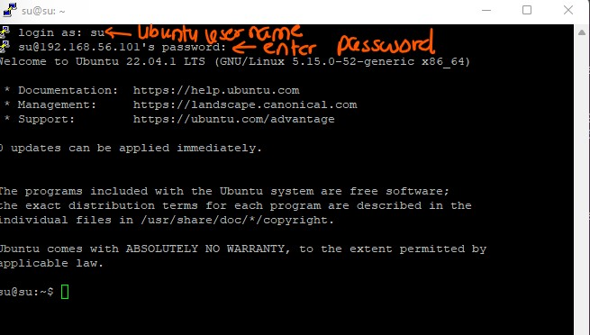

# Unix & Linux course


<details>
  <summary>Day 1 & 2: Intro to OS</summary>

- Contents
  - software basics
  - OS intro
  - Unix vs Linux vs Windows and their architecture
  - Linux installation
  - Putty and winscp tools setups
- Computer
  - Software
    - System Software -> Linux, interacts with hardware components
      - Device drivers and OS
    - Application Software -> All are application software except Operating Systems. e.g. Java, C/C++,Facebook, Twitter, Gmail
  - Hardware : hard disk, monitor,keyboard, RAM
- What is Operating Systems?

  - It is a platform where we can run all the application softwares
  - It is an interface between Application softwares and hardware components
  - Every OS has libraries (collection of C) and device drivers to communicate between application softwares and hardware components
    - Application Software
    - Shell
    - Libraries
    - Device Drivers
    - Hardware

- Device Drivers : Run devices and communicate with hardware components
  - All drivers are not part of OS.
  - Two types of drivers
    - Internal : Part of OS and are built in
      - They are to run internal parts of computer. e.g. keyboard, RAM, Monitor, mouse, hard disk, motherboard, USB drive,
    - External : you need to set up yourself
      - printer, scanner, fax machine

- **Categories of Operating System**
  - CUI/CLI : Character User Interface/ Command line interface
    - window command prompt
  - GUI : Graphical user interface
- Commands
  - dir : disk information report
- Single User OS
  - Only one user can use system resources such as files, apps, data
  - It does not support networking
  - Stand alone OS
- multiuser os
  - More than one user
  - can share system resources
  - Apps, data & files
  - It supports networking
  - Server OS e.g. Unix, Linux, Win-7,8,10,11
  - History of Microsoft Disk Operating System (MSDOS)
    - First OS in the market, Free
    - CUI, it does not support networking
    - Drawbacks => Standalone OS, no multiuser, multitask environment
    - CLI
    - Was developed in Assembly language
  - MS Window (GUI)
  - History of Unix
    - Developed in year 1973
    - It is CUI
    - Supports networking
    - It is a Server OS
  - Freeware (Oracle, Virtual Box, Putty => they can be downloaded and used for free and features cannot be changed)
  - Open source
    - It can be downloaded including source code
    - You can also modify the program
    - It can be distributed. Below are distributions(similar to brands) /flavours of unix OS
      - e.g. Linux - modified version of Unix , by Linux Torvald
      - Solaris => from Sunsoft (with oracle corp 2010)
      - IBM - AIX : from IBM
      - HP-UX : from Hallet Packward
      - BSD-Unix : Berkely software division
      - Mac OS : Machintosh
  - GUI (Graphical User Interface)
    - Windows is first GUI OS released in the year 1990.
    - win1.0 -> 1990 then evolve
    - win95 -> 1995 => most popular OS in 1990s - stand alone OS
    - To support Internet, Microsoft corp added networking technology.win-NT, server OS
    - win98
    - win2000, win2003, winXP till 2015, many companies use this winXP
    - win7, win8, wi10, win11
    - win-12- with linux kernel
  - Unix and Linux belong to Unix-like family 
    - 
</details>

---

<details>
  <summary>Day 3 : Distributions flavours</summary>

- Virtualisation - VMware
  -
- Linux is a modified version of unix OS
- 1989 - Linux Torvalds has taken unix source code and modified/added some more features
  - 1999 - Apache software foundation has taken over linux product and released as Linux in the market
  - Apache Linux => first officially released version in the market
    - GUI OS, Open source
  - Fedora Linux
  - Suse Linux
  - Debian Linnux
  - CentOS
  - Ubuntu Linux
  - Kali Linux
- What are the distributions of Unix OS?
  - Linux, Solaris, IBM-AIX
- What are the distribution of Linux OS?
  - Most popular version is Ubuntu (open source),Red Hat Enterprise (Licensed version), CentoS (free ware)
  - Software environments - Learning -> Ubuntu - Development - Testing - Production
  </details>

---

<details>
  <summary>Day 4 : Different users settings</summary>
 
- Settings -> Users 
  - passwd username 
  - sudo passwd testuser => you need sudo for enabling users to set password 
- [Install Chrome in Ubuntu](https://www.geeksforgeeks.org/how-to-install-chrome-in-ubuntu/)
  - Ctrl + Shift + Y => To check for download progress
</details>

---

<details>
  <summary>Day 5 : Install putty, remote server, Linux Features, Architecture, File System</summary>

- putty
  - Work with remote server
  - PuTTY is a terminal emulator application which can act as a client for the SSH, Telnet, rlogin, and raw TCP computing protocols. The word "PuTTY" has no meaning, though 'tty' is sometimes used to refer to the Unix terminals, as an acronym for 'teletype'.
  - PuTTY is the recommended application to use for SSH connections from a Windows operating system. PuTTY allows you to access your files and email stored on the engineering servers. It also provides a UNIX environment to run programs that some courses require.

- [Download putty](https://www.chiark.greenend.org.uk/~sgtatham/putty/latest.html)
  - Install and open the Putty app
  - In configuration, you will see Host Name (or IP address)
  - To get IP address, in Ubuntu terminal, type `ifconfig`. If it is not found, install it.
  - Look for inet
    - If you have two adapters, you choose the second one.
    - Device Manager -> VirtualBox Host-Only Ethernet Adapter e.g. 192.168.56.151
    - Add that address under HostName
  - You will have **Network error: Connection refused.**
    - Because SSH connection type is used. Set SSH up in Ubuntu
    - [`sudo apt-get update`](https://www.cyberciti.biz/faq/what-does-sudo-apt-get-update-command-do-on-ubuntu-debian/#:~:text=The%20sudo%20apt%2Dget%20update%20command%20is%20used%20to%20download,list.)
      - sudo : Sudo stands for either "substitute user do" or "super user do" and it allows you to temporarily elevate your current user account to have root privileges.
      - apt : Advanced Package Tool, more commonly known as APT, is a collection of tools used to install, update, remove, and otherwise manage software packages on Debian and its derivative operating systems, including Ubuntu and Linux Mint.
    - `sudo apt install ssh`
    - After you install ssh, you will be able to connect.
      - 
  - Change font size
    - Right click -> change settings -> Appearance -> Change
  - Create some files in putty server and check them in Ubuntu server
  - Duplicate Session
    - Connect to the same server, and you can connect with different user names
  - clear or Ctrl + l -> clear the terminal
  - `exit` from the login session. You need to `exit`, instead of closing it. 
  - `hostname` : is a computer name
- **winscp**
  - window secure copy
  - Its main function is file transfer between a local and a remote computer. 
  - WinSCP is a popular SFTP client and FTP client for Microsoft Windows! Copy file between a local computer and remote servers using FTP, FTPS, SCP, SFTP, WebDAV or S3 file transfer protocols. 
- *[Transfer files from windows to the server](https://winscp.net/eng/index.php)*
  - Download the setup.exe file
  - cp means secure copy
  - After installation, enter IP address , username and password.
- You can also use [Filezilla](https://filezilla-project.org/download.php?type=client)

- **Features of Linux - Theory Part**
  - Basic features of all OS : Win, Unix, Linux
    - Multi user OS
      - multiple users can chare the same OS
      - 
    - Multi tasking OS 
      - In window, type Services and check for all the things that are currently running 
      - In Linux, `ps -ef | wc -l`
        - ps is process 
        - to see the details, run `ps -ef`
  - Ony for Unix and Linux 
    - Open Source OS
    - Portable OS
      - Software can work with different hardwares.
      - Independent of hardware e.g. intel/amd, spark, ibm, apple hardware,
    - Secure OS
      - Virus
      - Hacking
      - In windows, there are two types: Client and Server.
        - Win 2008 R2 core - TUI text user interface model 
        - .exe e.g. To watch window, VLC media player download from internet is required. It could be affected by virus easily.
        - Therefore, you need to install Anti-virus for both clients and servers. 
      - Linux server is secure
        - In Linux, .rpm -> redhat package manager. .rpm won't be affected by virus. Therefore, no need to install any third party applications.
        - compared to window, subscriptions (centos, Rocky) are much cheaper. RHEL -> subscription
        - centos no support for production env, there for free
        - RHEL has support for prod env
      - Linux Family Types
        - Debian- Ubuntu, Debian
        - Red Head -  CentOS, Fedora, Rocky, etc.
      - Types of OS
        - SIngle User - Single Tasking -> MSDOS, super user 
        - Single User - Multi tasking -> MSWin
        - Multi User - Multi tasking -> Unix, Linux 
    - Shell scripting
      - Data processing
      - Automation of Admin activities (linux, hadoop, dba, aws, devops)
      - Job scheduling - crondev
      - Files backup
      - Data backup 
      - Development of gateways 
      - Dba backup scripts 
    - GUI 
    
- **Linux File System Theory**
  - Window 
    - DVD or Drive iso.image
    - iso.img
    - PC
    - Reboot OS-> BIOS -> F1 to F12, DEL, ESC 
      - First Boot -> Pen drive , F10 -> Save changes then reboot
    - A - Z drives letter concept for window
      - A and B are reserved for floppy disk..
      - C is reserved for Hard disk
    - In windows, there are two types of users: 
      - Admin : root user
      - Gust : normal user 
  - **Linux**
    - In Linux, there is no drive letter concepts. In linux, directory ( ~ folders) hierarchy.
    - forward slash / is the top level directory 
  - Top Level directory / 
  - /root /home /boot /etc /bin /sbin /usr /opt 
    - /root - root user 
    - /home - normal user
    - /boot - If there is an expected shutdown, 
      - To travel from Mamo to Cophenhagen, you need to use transport methods e.g. car, bike, train
      - Travel from Mamo to Cophenhagen without transport vehicles (bootable files), you will not be able to reach the destination (OS)
      - grub2 -> RHEL 7.0, 8.0 is the boot loader, depending on version, it will change.
        - ground unified boot loader version 2
        - LILO - Linux loader 
    - /etc contains configuration files
    - /bin contains normal user executable commands
    - /sbin contains root user executable commands (super user)
    - /usr - program files - install packges in this directory 
    - /op - is optional for usr , third parties software e.g. Ansible 
    - /proc - contains background running processes (similar to Task manager in Window)
      - `cat /proc/cpuinfo`
      - `cat /proc/meminfo`, Ram, swap is the virtual ram, If physical ram is full, swap will provide support 
    - /var/log - contains variable data 
      - contains log directory - we have log
    - /run - contains non-persistance real time data, running services, media, etc.. If you switch off the machine, you will loose those data
  - Difference between /dev and /run/media
  - /mnt - empty directory. To create a mount point for any partition
  - /lib - contains library files and sharable objects 
  - /temp - contains temporary files 

  - Symbolic links (short cut) - You can access resources quicker.
    - /bin -> /usr/bin
    - /sbin -> /usr/sbin
    - /lib -> /usr/lib 
    - /lib64 -> /usr/lib64

    ```
    cd /
    ls -l 
      you will see all the directories and soft symbolic links
    ```


  - **Three Types of files**
    - Regular file
      - It contains data
        - can be text e.g. Notepad, pdf, word files 
        - binary e.g. .exe files, images, audio, video
    - Directory is like folder from Window.
      - `ls`
      - contains sub directories and files
      - dash - is file
      - d is directory 
    - Device files 
      - Device drivers `cd /dev/`
      - all device drivers starts with c `ls -l`, link file `l`
      - 
      - 

- **Linux Architecture**
  - 
  - [Reading about Linux Kernel](https://developer.ibm.com/articles/l-linux-kernel/)

  - 
  - 
  - Architecture : Simple definition -> is a flow of data between different components of a project 
    - Browser, Facebook -> Middleware -> Database -> Hadoop-> BI tools
  - Linux architecture is a flow of data between different components of a Linux OS
  - There are two layers in Linux OS
    - Shell
    - Kernel
    ```
    echo $SHELL
    echo $0 
    echo $PATH 
    ```
    1. User request goes to the shell 
    2. Shell check whether the command exists
    3. Kernel takes the request, executes and generates outputs to hardware device 
  - Layers
    - C, C++, Java, Hadoop
    - Operating System
      - Shell 
        - Command interpreter 
        - It is an interface between user and kernel
        - Is an outer layer of Linux OS
        - How shell validates the command (shell scripting)
      - Kernel
        - Core layer of Linux system and consists of two layers:
          - Device Drivers - interacts with Hardware components
          - Libraries - communicates with Applications
            - keyboard driver, libraries -> scanf -> printf goes to output library -> output function -> output device driver -> screen 
    - Hardware - Linux can be installed into any hardware components, unlike unix.
  - [filetypes](https://www.geeksforgeeks.org/how-to-find-out-file-types-in-linux/)
    - 
    - 
    - [Files permission reading](https://devconnected.com/linux-file-permissions-complete-guide/)
  - Finished session - 11
  - If you cannot push the repo from terminal, Ubuntu, read this [thread](https://stackoverflow.com/questions/71495330/can-not-push-on-github-through-ubuntu-terminal)
  - [Quickly set up GitHub SSH example](https://www.theserverside.com/blog/Coffee-Talk-Java-News-Stories-and-Opinions/GitHub-SSH-Key-Setup-Config-Ubuntu-Linux)
  - Architecture 
    - Hardware : Processor (ALU - arthimcal logical unit )
    - Kernel : Device info, multi tasking info, file system info - they are all managed by Kernel 
      - Mono -> Linux like machine has this, `uname -a or -r`. This command can be used in both linux and window to find out the kernel version.
      - Micro -> Window like machine has micro kernel
    - RHEL (Bash) Shell -> SH, KSH, CSH
    - Kernel will provide the result from ALU to the monitor .

</details>


---


<details>
  <summary>Day 6 :Virtualisation and File System Diagrams</summary>

- Virtualisation 
  - Gmail account creation 
  - Use browser -> click sign up option (gmail web app)-> Form -> Details got stored in gmail db 
    - www.gmail.com (DNS services it will resolve host name)
    - Install different servers on different machines
      - Web     DB      DNSserver   DHCP
    - 
    - 
  - Window -> Hyper-V
  - Linux -> KVM
  - Oracle -> Virtual Box
  - VMware -> Workstation 16 Pro
- Virtualisation vs Containerisation
  - 
  

  ```
    VM - Win DHCP
    VM - DNS
    VM - Win DB
    VM - Linux Web
    Workstation 16
    Window 11 OS
  ```
- (Download VMWare Workstation](https://www.vmware.com/au/products/workstation-pro/workstation-pro-evaluation.html)
- Create a new VM
  - New VM Wizard
  - Typical (recommended) -> Next -> Next
  - Install from 
    - Installer disc:
    - Installer disc image file (iso) - RHEL7.0\rhel-server-7.0-x86
    - **I will install the OS later** - choose this option
  - Select a Guest Operating System
    - Linux 
    - [Red Hat Enterprise Linux 64 bit](https://developers.redhat.com/products/rhel/download) -> Next -> Next 
  - Give VM name
  - Specify Disk Capacity 
    - Maximum disk size - add 80GB
  - Options
    - Store virtual disk as a single file 
    - Split virtual disk into multiple files (if you provide 520GB or something)
  - Customise Hardware
    - Memory 4GB
    - Processors -> Number of core processor => 2
      - speed of processor , cycle per second
    - New CD/DVD -> select the file 
    - Network Adapter - NAT (wifi)  
      - If you use wifi - use Bridged: Connected direclty to the physical network
      - NAT (for landline)
      - Remove printer driver 
    - network time protocol 
      - rhel-pool.ntp.org and switch on Network Time. It will ensure to synchronise among machines. But for personal laptop, you do not need to turn on 
- File Structure continued
  -    **Revise above concepts this weekend - 5 & 6 Nov**
  
  - 

  - 

  - username@hostname(machine name):~$
    - ~ represents current home directory 
    - pwd -> /home/su
    - $ indicates that the user is normal user 
  - How to switch users 
    - Because of multi-user, multitasking concepts, you can switch 
    - root@localhost:~$
    - /home/root
  - `su - root` and enter password  and then exit. You will get back to your normal user
  - Absolute vs relative paths 
    - absolute path - full path 
    - relative path - short path 
  
</details>

---

<details>
  <summary>Day 7 : Continued Basic commands </summary>

- `command option argument`
  - option will adjust the behaviour of command
  - argument - command output we want to print
- `cal` : current month calendar
- `cal -y `
- `cal --help`
- Predefined variables are in CAPITAL LETTERS
- single - for unix, -- for GNU therefore
- Linux variables types 
  - Environmental variables 
  - User defined variables
- `echo $HOME` - print directory of the current user
- `pwd vs echo $HOME` : what is the difference even though we get the same output?
  - You call someone , ask where she/he is at 06:00am. Answer: Home
  - You call the same person at 09:00. Answer: Office. **It is pwd.**
  - $HOME is always home address regardless of which directory you are at.  
- `echo $0 or echo $SHELL` - what shell we use?
- `echo $BASH_VERSION` - shell version
- `NAME=yourname` and `echo $NAME`
- `env` : find out how many predefined are variables are in the system
- `N$=1` : command not found
- `uname -a`: check kernel version, gives detailed version
- `uname -r` : print only kernel version
- `tty` : terminal numbers 
- `id username` : to find out the identification of the user, whether there is a user or not
- `whoami` - will give you the current login user name. If username is not provided, it will give you root
- `clear or ctrl + l`
- `date` : will print system date and time 
- `date +%D`
- `date +%b`
- `date +%B`
- `date +%H`
- `date -s "yyyy-mm-dd hh:mm:ss"` : Change system date 
- Select + Shift + Insert - to copy and paste
- `timedatectl` - new command since RHEL 7 version 
  - RTC - real time clock - system BIOS time 
  - NTP - there is no NTP server , therefore, it is not active 
- `timedatectl list-timezones` and q for quit 
- `timedatectl set-timezone "AFrica/Juba"` - you have to be as root user 
- single tab -> all time related commands
- double tabs -> it will give the entire command
- `timedatectl set-ntp true`
- `cat` : concatenation of files, concatenate  files and print on the standard output
  - `cat > file.txt` and add your text and save by `ctrl + D`
  - `cat < file.txt or cat file.txt` : print the file content 
  - `cat file1.txt file2.txt > outputfile.txt`

- 
- , from (this link)[https://www.reddit.com/r/linux/comments/cw922a/this_is_my_personal_linux_commands_cheat_sheet/]
</details>

---

<details>
  <summary>Day 8 : Touch, mkdir, tree, cd, cp, mv , rm commands</summary>

- touch
  - `touch file1 file2`: 
  - `touch file{1..3}`: create multiple files - regex 
  - `touch -d "yyyy-mm-dd HH:MM:SS" file1` : change timestamp
    - **Why we need to change date and time for files?** 
      - [Check ](https://phoenixnap.com/kb/touch-command-in-linux)
  - `mkdir country{1..5}` : create directories - country1 to country5
  - `mkdir -p Parent/ChildFolder/GrandChild` : -p is parent
  - `ls -R Parent/` : how many directories are in this folder
    - R is recursive 
  - `mkdir -p NIT/{Linux/{Ubuntu, RHEL}, Microsoft/{Developer, SolutionArchitect}, DevOps/{Dockers,Kubernetes}}` : Multiple tree structure 
  - `tree Foldername` : will show youu tree directory
  - `cd FolderDestination` : change between directories 
  - `cp` : copies
  - `ls -al DirectoryName` : 
  - `cp -rvf dir1 dir2` : 
    - 
  - `mv File1Source File2Destination` : rename
  - `rm -r ls directory` : 
  - `rm file*` : everyfile that starts with file will be deleted. 

</details>

---

<details>
  <summary>Day 9: File Types , Soft & hard links, ls and its options </summary>

- File Types
  - dirs directory
  - c character files e.g. Keyboard, mouse, etc. 
  - block file e.g. Hard disk hdd, pendrive, dvd - inside dev directory 
  - l link files
    - soft link : shortcuts - access resources quicker 
    - hard link : it is a backup file, copy 
  - 
  - 
- `ls -l | grep ^l` : filter link files
- `file File2` - Check the file type
- `cat > soft` write something. To save `ctrl + D`
- `ln -s /home/su/soft sl` : s is option
- `cat >> sl` : change the text 
- `cat /home/su/Desktop/sweden`
- `du -h` : disk usage human readable format 
- `ls -i /home/su/Desktop/soft` : inode properties
- `rm -rf`
- `cat > hard `
- `cat hard`
- `cd Desktop`
- `pwd`
- `ln /home/su/hard h1`
- `cat >> h1`
- `cat /home/su/hard`
- `du -h h1`
- `ls -i hl`
- `ls -i /home/su/hard`
- `cat hl`
  - 
- **ls command syntax**
  - `ls -l`
  - `ls -l F*` : fileter starting F 
  - `ls -l *1`
  - `ls -l [FL]*` List all the files with FL*
  - `ls -l [FKc]*`
  - `ls -ld dir*` : list all directories
  - `ls -ld d*`
  - `ls -al`: filter hidden files all files including hidden files
  - `ls -al`: Create hidden file, add . , 
  - `mkdir .dirExample`
  - `touch bat cat fat hat mat rat`
    - `ls -l *[at]`
    - `ls -l ?at`
    - What is the difference between * and ? ? Arguments are different.
      - * : wild card
      - ? : will consider only one character from the file name
  - `ls -l F?`
  - `ls -l F*`
  - `ls -l ????` : four questions marks ???? it will print all four characters files will be printed.
  - `ls -l [a-c]*`
  - `ls -ltr` : reverse file - sort the file as per descending time order. Current file will be displayed first


</details>

---

<details>
  <summary>Day 10 : Create/edit file with CUI vs GUI, why you should choose CUI</summary>

- `gedit or vim filename` : `esp`
- `vi vs vim`
  - visual display editor
  - visual display editor improved 
- `tty` - terminal number 
- `vi /etc/passwd`
  - switch command mode to insert mode - i 
  - visual mode - v-key 
  - `wq` save and quit
  - save changes - extended command :wq save and quit 
  - gg start
  - G end of the file 
  - nw - word by word curser forward
  - nb - word by word curser back
  - ndd - to cut the line, p to paste
  - u - undo the link, ctrl + r redo
  - nyy - to copy line
  - :q - to quite
  - :w - to save
  - :x - to save and quit 
  - A - start
  - a - next letter insert mode
  - Add empty line below the curser 
  - - `:x` - save and quit 
- `w` - just save, don't quit
- `vim /etc/sudoers` - 
- `vim `
- `/searchword`
- `s/Linux/Windows`
- `:%s/Linux/Windows` - replace all 
- `:8` - 8th line, `:9` - 9th line
- `:X` - to assign the encrypted password, to remove the password, `:X` - do not enter anything
- `vim -o file1 file2` - how to open multiple files
- `vimtutor` - all the commands 
- 
- 
- 


</details>

---

<details>
  <summary>Day 11</summary>

- man
- redirect
- user management concept 
- ``
- ``
- ``
- ``
- ``
- ``
- ``
- ``
- ``
- ``
- ``
- ``
- ``
- ``
- ``
- ``
- ``
- ``
- ``

</details>

---

<details>
  <summary>Day 12</summary>
</details>

---

